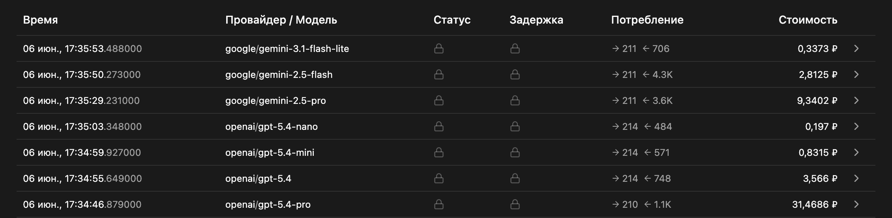

Бала дана алгоритмическая задача, в условии специально была допущена ошибка. 
Инетересно как модели по разному восприняли эту ошибку. Большие модели обосновали ошибку в условии и подстроили решение под новые вводные. Маленькие модели либо выдали просто неверный ответ, либо вовсе проигнорировали нестыковку. 

Время ответа маленьких и средним моделей в среднем одинакова, около 10 сек. Gemini pro думал уже 20-30 секунд. Gpt pro дольше двух минут, но и ответ дал сравнительно чище и точнее. 

Цены на один и тот же запрос отличаются разительно, от несольких копеек на маленьких моделях, до 50р на 2к токенов ответа для gpt-5.4-pro

